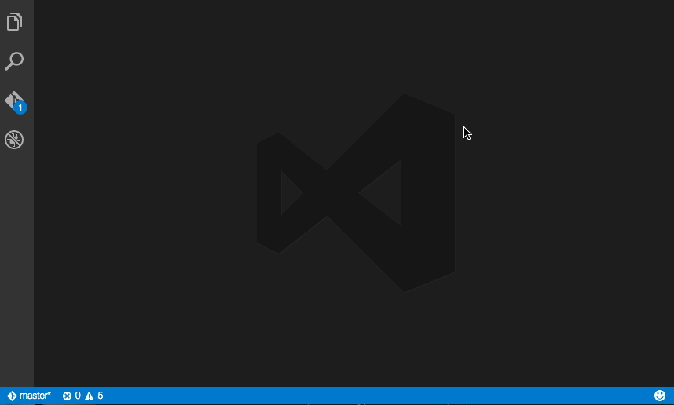

# vscode-titanium

## Installation

Press <kbd>F1</kbd> and narrow down the list commands by typing `extension`. Pick `Extensions: Install Extension`.
Select the `Extension for Titanium, Alloy and JAST` extension from the list


## Manual Install

**Mac & Linux**
```sh
cd $HOME/.vscode/extensions
```
**Windows**
```sh
cd %USERPROFILE%\.vscode\extensions
```

**All Platforms**
```
git clone https://github.com/dbankier/vscode-titanium.git
cd vscode-titanium
npm install
```


## Usage

### Build Commands

Press <kbd>F1</kbd> and enter one fo the following:

~~~
Titanium: build
Titanium: shadow
Titanium: appify
Titanium: clean
~~~

Just follow the steps. Here is an example.



### Open Splits
Use <kbd>CMD</kbd>+<kbd>L</kbd> or <kbd>CTRL</kbd>+<kbd>L</kbd> to open alloy splits.


By default the plug assumes you are using [JAST](https://github.com/dbankier/JAST).

You can use the following configuration options to modify the default extensions.

~~~
				"alloy.style": ".tss"
				"alloy.view": ".xml",
				"alloy.controller":  ".js"
~~~


## Keybord Shortcut

The following are the commands that you can assign shortcuts to:

~~~
extension.openAlloyFiles
extension.tiBuild
extension.tiBuildShadow
extension.tiBuildAppify
extension.tiClean
~~~

## Future
To Do (maybe):
  * TSS/STSS syntax highlight and completion
  * Integrate [titanium-typescript](https://github.com/airamrguez/titanium-typescript) for `js` completion

## License

MIT © [David Bankier @dbankier](https://github.com/dbankier)
[@davidbankier](https://twitter.com/davidbankier)